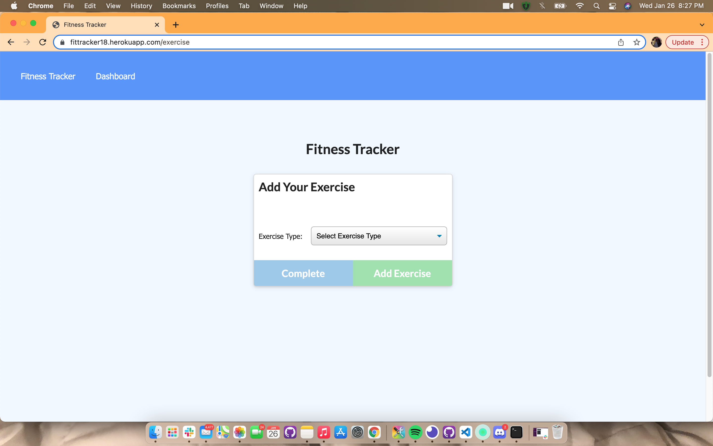

# Fitness Tracker
Homework 18

 

# Link to deployed app

## [Click](https://fittracker18.herokuapp.com/)

# Technologies used:

Node.js, Mongoose, Mysql, MongoDB

# Overview
For this assignment, a workout tracker was created. This assignment used  Mongo database with a Mongoose schema and handle routes with Express.

# License
MIT
 
# Contact Info
https://github.com/bryonbsmb1